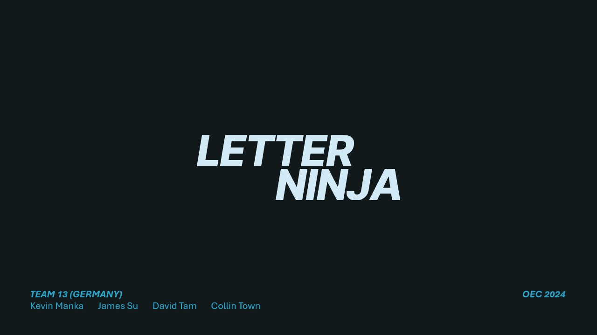
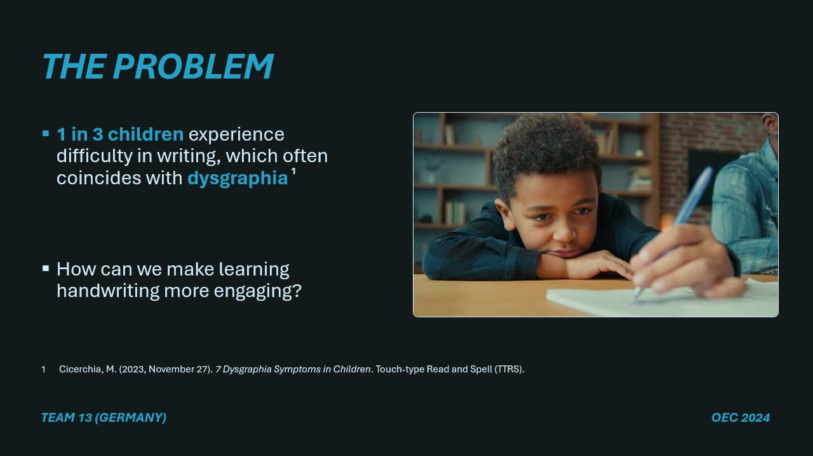
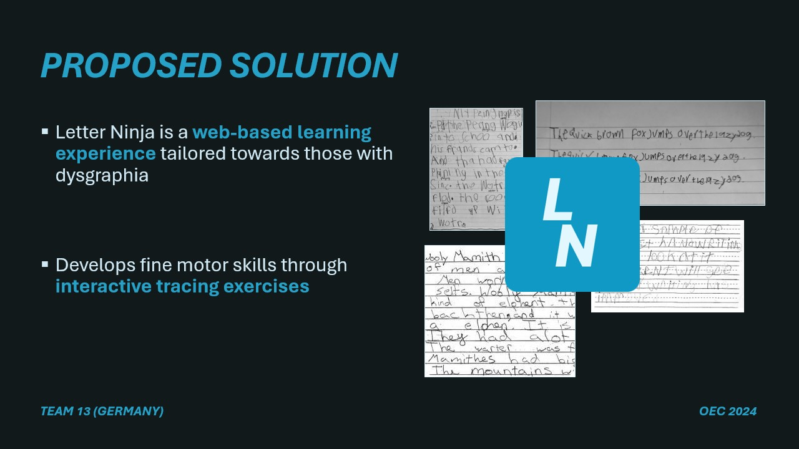
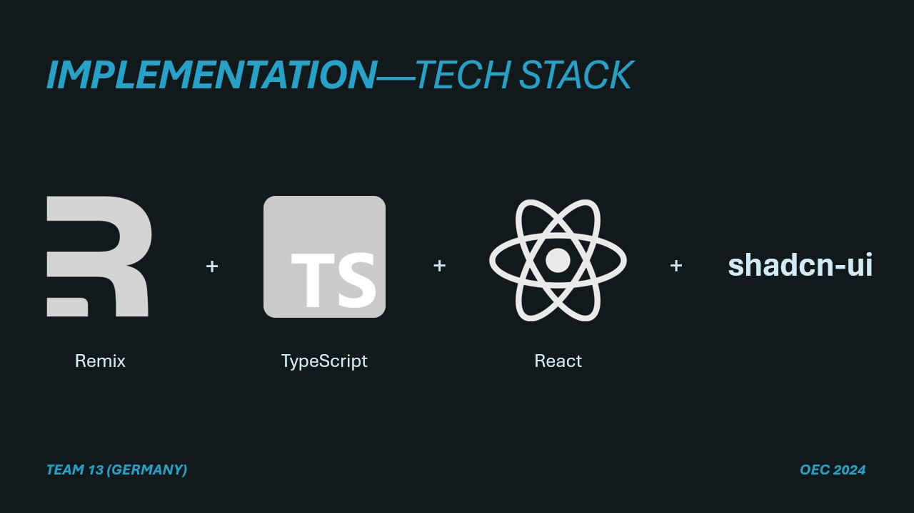
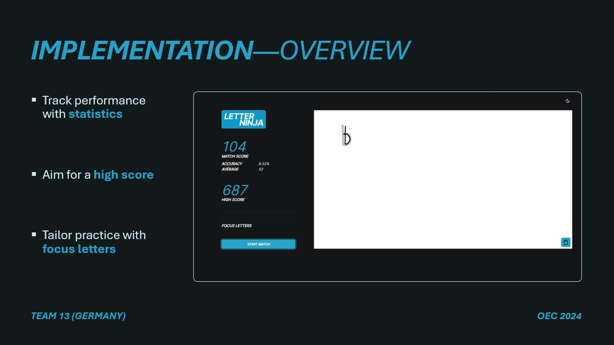
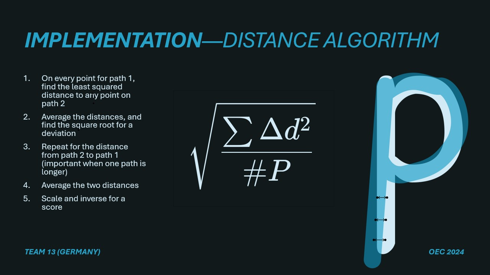
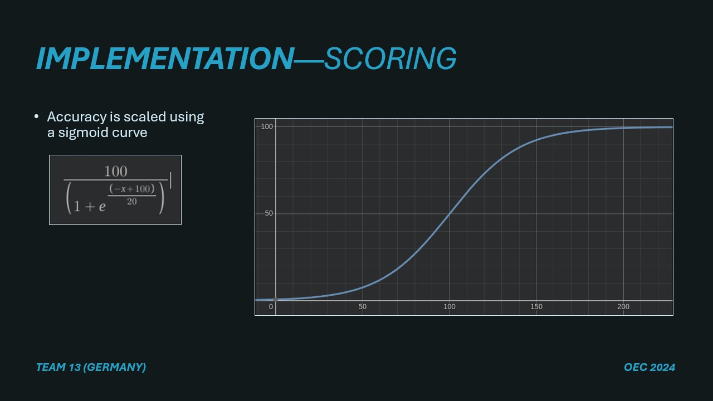
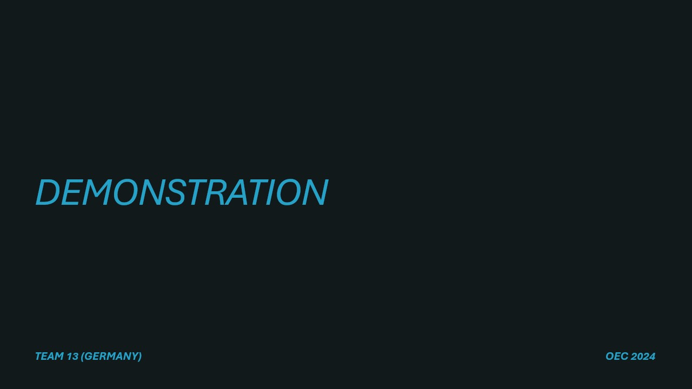
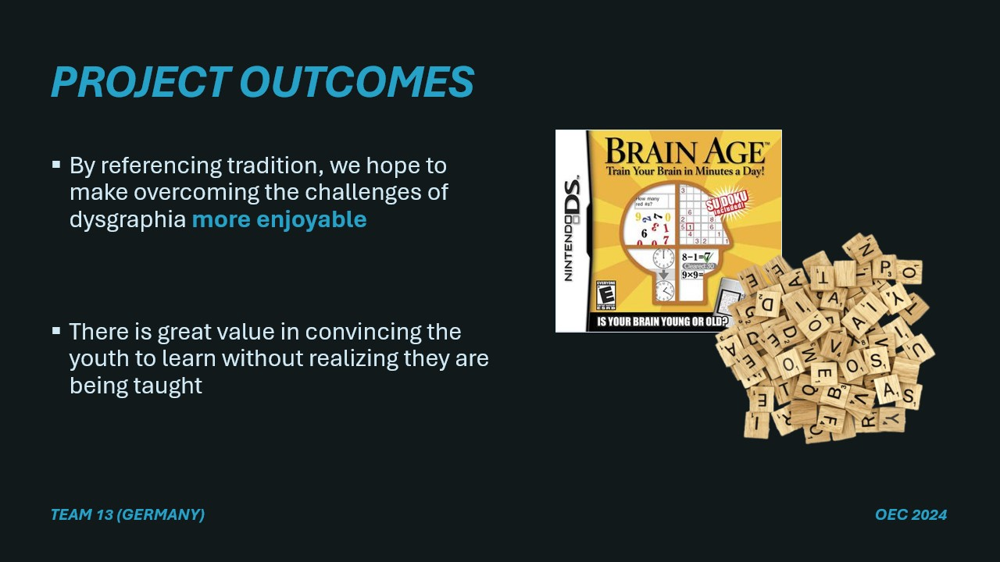

# OEC 2024: Letter Ninja by Team Germany [Western University]
- this Readme has been edited after the competition to include the school name and more detailed docs + presentation slides 

### Delegates: Kevin Manka, James (Jimmy) Su, David Tam, Collin Town

### Primary Code Locations:
- Main Application: app\routes\_index.tsx
- Algorithm: app\lib\utils.ts
- Reference Letter Paths (i.e. ideal paths to compare to): app\lib\letter-paths.ts
- Game State Tracking: app\lib\game-state.ts

Setup Instructions:
- ensure you have a recent version of node (18 or newer will definitely work)
1. Run `npm install`.
2. Run `npx shadcn-ui@latest add button input card dropdown-menu`.
3. Run `npm run dev`.
4. access the website at [http://localhost:3000](http://localhost:3000)
   1. This web app is developed for touch screen laptops, and tablets
   2. it can work on phones or with a mouse, but the experience will be suboptimal

## Presentation Slides

